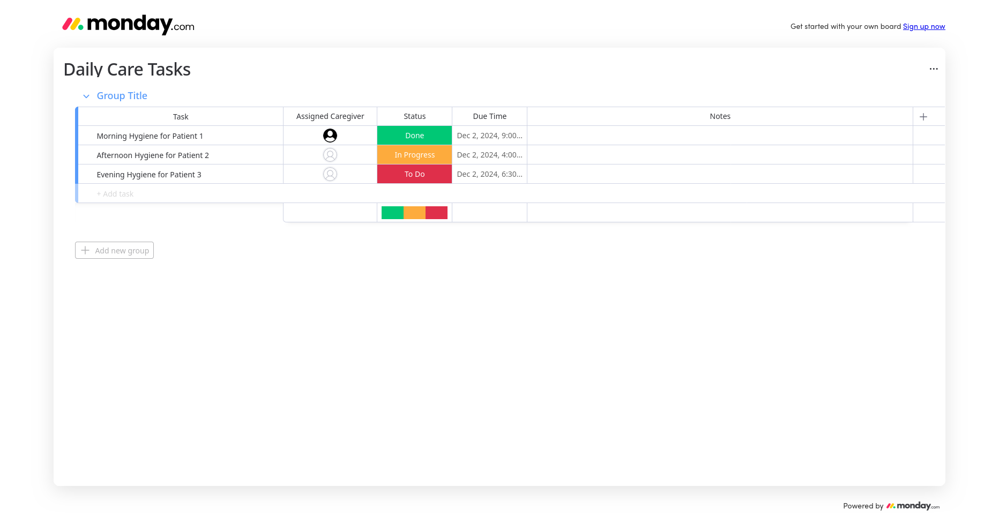
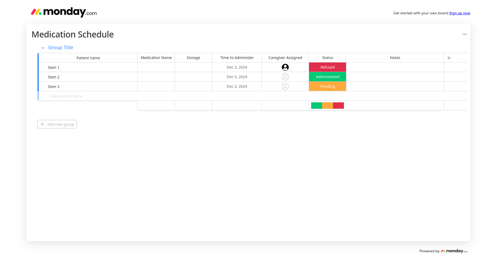
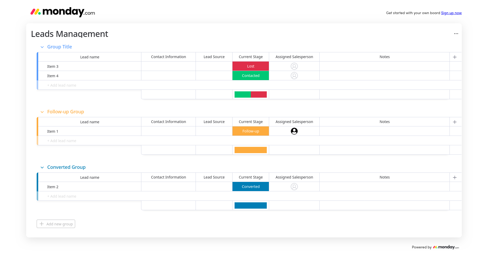
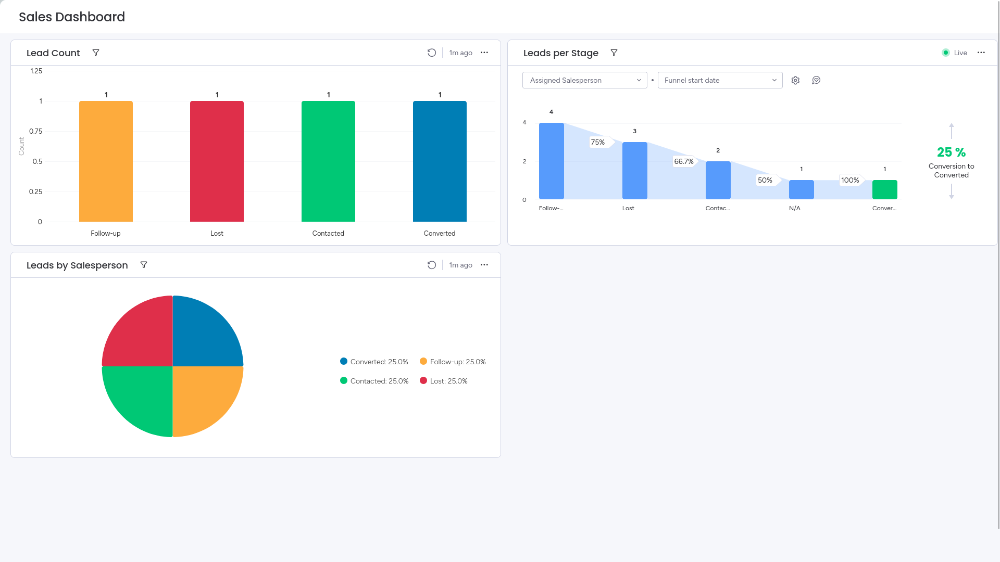
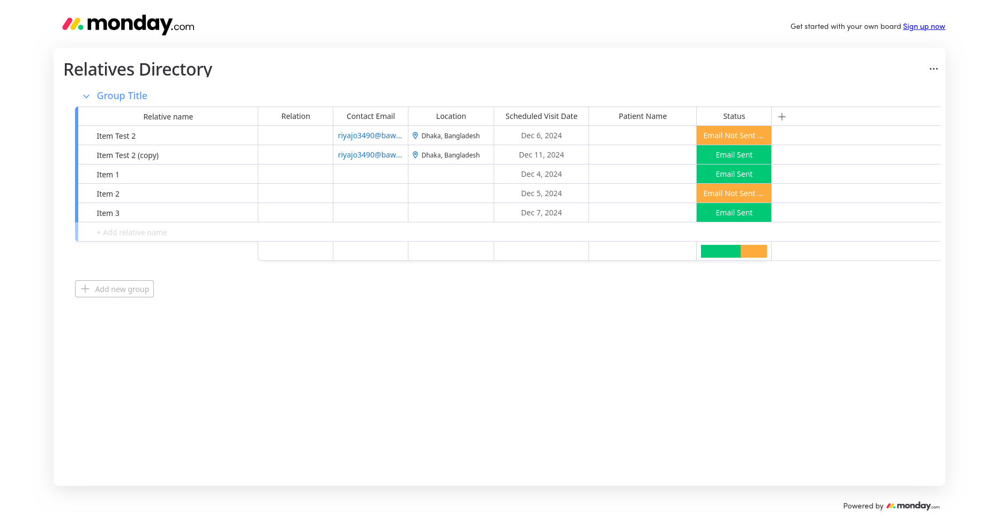
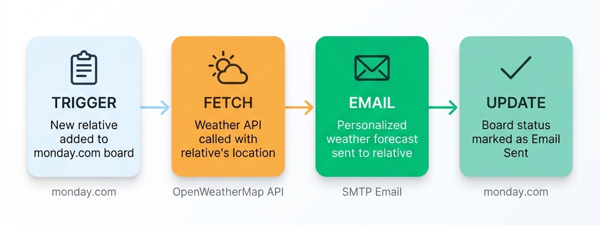
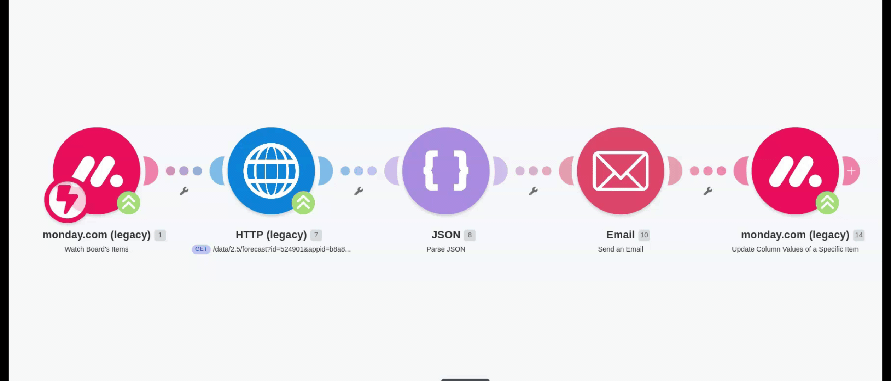

<div align="center">

# 🏥 PatientCare-Ops-Automation

**End-to-end operations management and intelligent automation for an assisted living facility**


-6D00CC?style=for-the-badge&logo=make&logoColor=white)


</div>

---

## Overview

**Patient Care** is an assisted living facility with 8 beds, 3 caregivers, and a sales team. Before this project, everything ran on memory and manual tracking — caregiver tasks were easy to miss, medication logs had no accountability trail, the sales pipeline had zero visibility, and visiting relatives received no proactive communication.

This project replaces all of that with a structured, automated operations system — from daily task boards and medication tracking to a sales CRM with live dashboards and a smart weather notification system that emails relatives before their visit.

> **No code was written.** The entire system was built using no-code/low-code tools: [monday.com](https://monday.com) for workflow management, [Make (Integromat)](https://www.make.com) for automation orchestration, and the [OpenWeatherMap API](https://openweathermap.org/api) for live weather data.

---

## The Problems

| # | Area | What Was Happening |
|---|------|--------------------|
| 1 | **Caregiver Tasks** | No structured daily checklist — duties were easy to forget or overlap |
| 2 | **Medication Tracking** | No system to log dosages, timing, or patient refusals |
| 3 | **Sales Pipeline** | No way to track leads, conversions, or team performance |
| 4 | **Sales Visibility** | No dashboard showing monthly metrics at a glance |
| 5 | **Relative Visits** | No directory of visiting relatives, no proactive outreach |
| 6 | **Visit Communication** | No way to inform relatives about weather conditions for their trip |

---

## What Was Built

### 1. Daily Care Task Board

A centralized board where each caregiver sees their assigned duties for the day — morning hygiene, afternoon routines, evening care — with clear status tracking (**To Do** → **In Progress** → **Done**) and due times. Nothing gets missed.

<div align="center">

</div>

---

### 2. Medication Schedule

A structured tracker that logs every medication event:
- **Which patient** receives which medication
- **Dosage** and **administration time**
- **Which caregiver** is responsible
- **Status**: Administered ✅ | Pending ⏳ | Refused ❌

If a patient refuses medication, the caregiver logs it with a note — creating a full accountability trail for patient safety.

<div align="center">

</div>

---

### 3. Sales CRM & Live Dashboard

A lead management system for the sales team, organized by pipeline stage:

| Stage | Purpose |
|-------|---------|
| **New / Contacted** | Fresh leads entering the system |
| **Follow-up** | Leads actively being pursued |
| **Converted** | Successful patient admissions |
| **Lost** | Leads that didn't convert (tracked for learning) |

<div align="center">

</div>

<br/>

Connected to a **live Sales Dashboard** that auto-updates with:
- Total lead count by stage
- Conversion funnel with drop-off percentages
- Leads breakdown by salesperson

<div align="center">

</div>

---

### 4. Relatives Directory + Automated Weather Alerts

A directory of patient relatives storing their contact details, physical location (with coordinates), and scheduled visit dates. But the real magic is what happens *automatically* when a new relative is added.

<div align="center">

</div>

---

## ⚡ The Automation: How It Works

When a new relative is added to the directory, a **4-step automation pipeline** fires automatically:

<div align="center">

</div>

**Here's the automation flow running inside Make:**

<div align="center">

</div>

<br/>

**What the relative receives** — a personalized email containing:
- A greeting using their name
- Temperature forecast for the scheduled visit date
- Weather conditions (e.g., clear sky, light rain, overcast)
- A warm closing from the Patient Care team

---

## Bonus Automations

Beyond the core requirements, two proactive automations were added:

| Automation | What It Does |
|------------|-------------|
| **📋 Daily Medication Summary** | Caregivers receive an automated email each morning summarizing the day's medication schedule |
| **🔔 Stale Lead Nudge** | Sales staff get notified when a lead has been sitting idle in the pipeline, prompting timely follow-ups |

---

## Tools & Platforms

| Tool | Role in This Project |
|------|---------------------|
| [**monday.com**](https://monday.com) | Workflow boards for tasks, medications, CRM, relatives directory, and the sales dashboard |
| [**Make (Integromat)**](https://www.make.com) | Automation engine that connects monday.com → Weather API → Email → Status update |
| [**OpenWeatherMap API**](https://openweathermap.org/api) | Provides real-time weather forecast data based on geographic coordinates |
| **SMTP (Email)** | Delivers personalized weather notification emails to relatives |

---

## Repository Contents

```
PatientCare-Ops-Automation/
│
├── README.md                                  ← You are here
├── Integration Monday.blueprint.json          ← Importable Make.com automation blueprint
│
└── snaps/                                     ← Visual evidence of all boards and dashboards
    ├── daily_care_tasks.png
    ├── medication_schedule.png
    ├── leads_management.png
    ├── relatives_directory.png
    ├── sales_dashboard.png
    └── motion/
        └── flow_explanation_of_monday_integration.gif
```

---

## Reusing the Automation Blueprint

The `Integration Monday.blueprint.json` file is a fully exportable **Make.com scenario**. To set it up in your own environment:

1. **Create accounts** on [monday.com](https://monday.com) and [Make.com](https://www.make.com)
2. **Set up a monday.com board** called "Relatives Directory" with these columns:
   - Relative Name, Relation, Contact Email, Location (with lat/long), Scheduled Visit Date, Patient Name, Status
3. **Import the blueprint** into Make: go to *Scenarios → Import Blueprint* and upload the JSON file
4. **Connect your accounts**:
   - Link your monday.com workspace
   - Link your email provider (SMTP/OAuth)
5. **Get a free API key** from [OpenWeatherMap](https://openweathermap.org/api) and paste it into the HTTP module
6. **Activate** the scenario — it will now trigger automatically when a new relative is added

> **Note:** All credentials in the blueprint have been replaced with placeholders. You'll need to plug in your own API key, email connection, and monday.com workspace.

---

## License

Distributed under the [MIT License](LICENSE).
